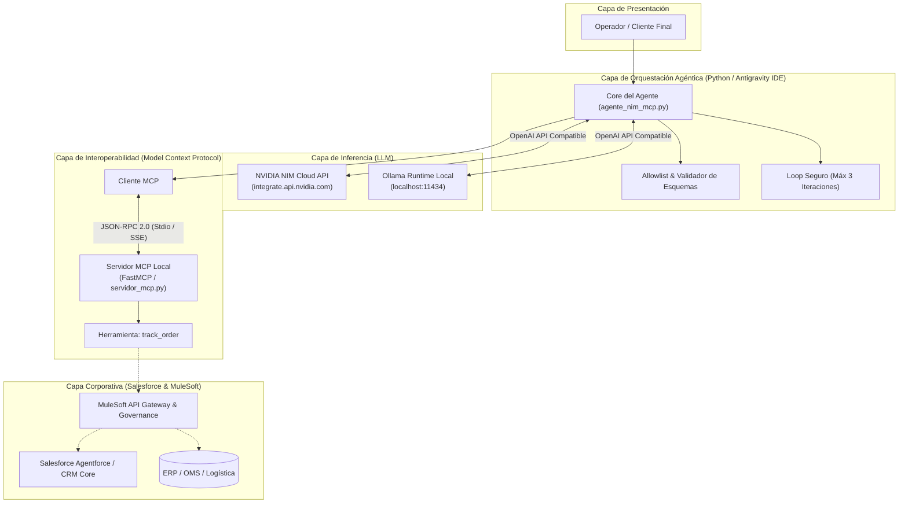

# Práctica Enterprise: NVIDIA NIM, Ollama, MCP y Salesforce

> **Bootcamp SKALA - Semana 2**  
> **Instructor:** M.C. Fernando Morquecho  
> **Desarrollado por:** Emmanuel Sánchez  
> **Entorno:** Antigravity IDE (Extensión Pack Salesforce) | Windows 11 & WSL2 Ubuntu  

---

## 1. Propósito de la Solución

El objetivo de esta solución es construir una arquitectura de agente inteligente de nivel **Enterprise** que:
1. **Desacopla la inferencia del modelo:** Conecta de manera intercambiable con **NVIDIA NIM** (nube corporativa optimizada) y **Ollama** (ejecución local offline).
2. **Estandariza la integración de herramientas mediante MCP (Model Context Protocol):** El modelo no interactúa con bases de datos ni con Salesforce directamente; descubre y ejecuta herramientas a través de contratos tipados JSON-RPC expuestos por un servidor MCP.
3. **Prepara el terreno para Salesforce & Agentforce:** Define los patrones de integración empresarial donde Agentforce puede actuar como cliente consumidor de MCP o donde Salesforce/MuleSoft exponen capacidades del CRM mediante servidores MCP gobernados.

---

## 2. Claridad Conceptual Crítica (Fundamentos Arquitectónicos)

Para evitar errores conceptuales en diseño de software y auditorías de seguridad:

| Concepto | Qué es y qué hace | Qué NO es / Qué NO hace |
| :--- | :--- | :--- |
| **LLM** (Large Language Model) | Red neuronal que procesa tokens, interpreta lenguaje natural y propone llamadas a herramientas (`tool_calls`). | **No es una base de datos ni ejecuta código** por sí mismo. No consulta Salesforce directamente. |
| **NVIDIA NIM** | Plataforma de microservicios e inferencia acelerada optimizada por NVIDIA que expone modelos mediante APIs estándar seguras. | **No es el LLM en sí** (es el runtime que lo sirve) ni es un servidor MCP. |
| **Ollama** | Runtime ligero para descargar y ejecutar modelos de lenguaje en hardware local. | **No sustituye a NIM** ni es un entorno de producción masiva empresarial. |
| **MCP** (Model Context Protocol) | Protocolo abierto estandarizado (JSON-RPC) para descubrimiento de herramientas, recursos y prompts entre agentes y sistemas externos. | **No ejecuta la inferencia** del modelo ni reemplaza los modelos de lenguaje. |
| **Agente Orquestador** | Aplicación que coordina el ciclo de vida: invoca inferencia, valida esquemas con allowlists, ejecuta herramientas y retorna resultados al LLM. | **No debe delegar decisiones de seguridad críticas** únicamente al prompt del modelo. |
| **Agentforce** | Plataforma de agentes autónomos integrada en Salesforce para automatizar procesos de negocio sobre Data Cloud. | **No sustituye a MuleSoft** ni a los sistemas de integración de la empresa. |
| **MuleSoft** | Capa de integración empresarial (Anypoint Platform) para gobernanza, seguridad, transformación de APIs y políticas de acceso. | **No es un modelo de lenguaje**. |

---

## 3. Patrón de Inferencia Híbrida Desacoplada (Factory / Adapter Pattern)

Uno de los pilares arquitectónicos más relevantes de esta implementación para **evaluaciones técnicas y reclutadores de ingeniería** es la eliminación absoluta del *Vendor Lock-in* mediante el desacoplamiento de la capa de inferencia:

```text
                               ┌────────────────────────────────────────────────────────┐
                               │                 LLMProviderFactory                     │
                               │           (Patrón Creacional / Adapter)                │
                               └──────────────────────────┬─────────────────────────────┘
                                                          │
                                         ¿LLM_PROVIDER en .env?
                                         /                      \
                                    'nvidia'                  'ollama'
                                       /                          \
             ▼───────────────────────────────────────▼      ▼───────────────────────────────────────▼
             │      NVIDIA NIM (Cloud API)           │      │       Ollama (Local Runtime)          │
             ├───────────────────────────────────────┤      ├───────────────────────────────────────┤
             │ • Endpoint: integrate.api.nvidia.com  │      │ • Endpoint: localhost:11434           │
             │ • Modelo: Nemotron / Llama 70B        │      │ • Modelo: llama3-groq-tool-use:8b     │
             │ • Entorno: Producción masiva en nube  │      │ • Entorno: Edge / Dev Offline / 0$    │
             │ • Autenticación: NVIDIA_API_KEY       │      │ • Privacidad: 100% de datos en local  │
             └───────────────────────────────────────┘      └───────────────────────────────────────┘
```

### Justificación de Ingeniería para Entornos Enterprise:
1. **Eficiencia de Costos y Privacidad (Edge Computing):** Durante fases de desarrollo, depuración y pruebas unitarias de herramientas MCP, el sistema opera con **Ollama Local** (`llama3-groq-tool-use:8b`). Esto permite iterar con latencia baja, sin costo por token y con privacidad total de datos confidenciales.
2. **Escalabilidad en Producción:** Cuando el sistema pasa a cargas de trabajo intensivas, se conmuta a **NVIDIA NIM** simplemente cambiando `LLM_PROVIDER=nvidia` en `.env`. NIM aporta inferencia acelerada sobre GPUs empresariales Tensor Core y microservicios contenerizados.
3. **Principio de Sustitución de Liskov e Interfaz Común:** Ambas soluciones implementan contratos compatibles con la especificación OpenAI (`/v1/chat/completions`), permitiendo al agente orquestador (`AgenteOrquestadorMCP`) descubrir, validar y ejecutar herramientas MCP sin cambiar una sola línea de código fuente.

---

## 4. Diagrama de Arquitectura de la Solución



---

## 5. Estructura del Proyecto

```text
D:\bootcampSem2\
├── .env.example            # Plantilla de variables de entorno (sin credenciales)
├── .gitignore              # Protección estricta de secretos y entornos
├── requirements.txt        # Dependencias fijadas y auditadas
├── README.md               # Documentación general y arquitectura
├── verificar_entorno.py    # Script de diagnóstico y verificación inicial
├── probar_nim.py           # Validación aislada de inferencia contra NVIDIA NIM
├── servidor_mcp.py         # Servidor MCP con herramienta 'track_order'
├── test_servidor_mcp.py    # Pruebas unitarias de descubrimiento e invocación MCP
├── agente_nim_mcp.py       # Agente orquestador con soporte NIM / Ollama y MCP
└── test_suite_automatizada.py # Suite de pruebas automatizadas con pytest
```

---

## 6. Guía de Instalación y Ejecución Paso a Paso

### Paso 1: Configurar el Entorno Virtual

En PowerShell o Bash (WSL):
```bash
# Crear entorno virtual aislado
python -m venv .venv

# Activar el entorno virtual:
# En Windows PowerShell:
.venv\Scripts\Activate.ps1
# En Linux / WSL:
source .venv/bin/activate

# Actualizar pip e instalar dependencias:
python -m pip install --upgrade pip
python -m pip install -r requirements.txt
```

### Paso 2: Verificar el Entorno
Ejecutar el script de diagnóstico:
```bash
python verificar_entorno.py
```

### Paso 3: Configurar Credenciales Seguras (.env)
```bash
cp .env.example .env
```
Edita `.env` con tu configuración (`LLM_PROVIDER=ollama` para pruebas locales o `LLM_PROVIDER=nvidia` para la nube).

### Paso 4: Protocolo para Retomar el Proyecto (Quickstart si cierras la terminal)
Si cierras tu terminal o reinicias el equipo:
```powershell
# 1. Navegar y activar entorno
cd D:\bootcampSem2
.venv\Scripts\Activate.ps1

# 2. Si usas Ollama Local, asegúrate de que el daemon esté activo
# (Abre la app de Ollama en Windows o corre en otra consola: ollama serve)

# 3. Ejecutar el Agente con MCP
python agente_nim_mcp.py

# 4. O correr pruebas unitarias del servidor MCP
python test_servidor_mcp.py
```

---

## 7. Políticas de Seguridad Zero-Trust Aplicadas

1. **Gestión de Secretos:** `.env` está expresamente excluido en `.gitignore`. Ninguna clave se imprime en logs ni se envía en prompts.
2. **Control de Bucles Infinitos:** El orquestador limita a **3 iteraciones máximas** el ciclo de tool calling.
3. **Allowlist Estricta:** Solo se autoriza la ejecución de herramientas explícitamente registradas en la lista blanca (`track_order`).
4. **Resistencia a Alucinaciones:** Si un pedido no existe en el sistema, la herramienta responde estructuradamente `{"error": "No encontrado"}` y el modelo informa al usuario sin inventar estados.
5. **Principio de Mínimo Privilegio:** Operaciones de solo lectura en esta fase (`READ-ONLY`).

---
Desarrollado con rigor de ingeniería por **Emmanuel Sánchez**.
